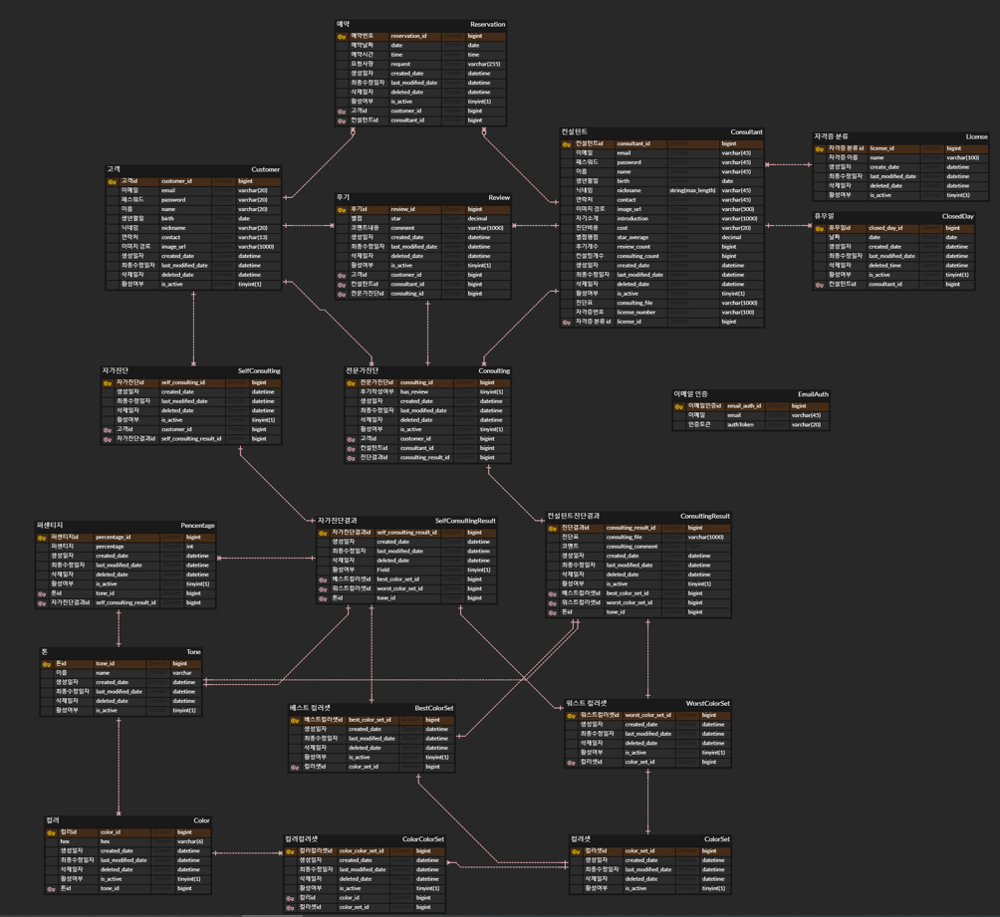

# 🎨 온라인 퍼스널컬러 진단 서비스, 당신의 계절

## 🖥 1. 프로젝트 소개

퍼스널 브랜딩 열풍 속에서 언제나 어디서나 온라인으로 퍼스널 컬러 진단을 받아보세요!

- 주요 기능
  - 회원 관리
  - 퍼스널컬러 자가 진단
  - 퍼스널컬러 컨설턴트와의 화상 진단
- 주요기술
  - WebRTC
  - WebSocket
  - JWT Authentication
  - REST API

## 📋 2. 프로젝트 정보

### 프로젝트 기간 및 참여 인원

`2022.07.04 ~ 2022.08.19.(7주)`
<br>
팀 프로젝트 (6명)

### 프로젝트 개발 환경 및 사용 기술 스택

🔥 **Backend**

- IntelliJ
- Java 1.8
- Spring Boot 2.7.1
- Spring Data JPA
- Spring Security
- MySQL 8
- Redis

🔥 **Frontend**

- Visual Studio Code IDE
- React.js 18.2.0
- Material UI 5.9.1
- Redux toolkit 1.8.3
- Redux 8.0.2

🔥 **WebRTC**

- openvidu 2.22.0

🔥 **CI/CD**

- AWS EC2
- docker
- nginx

🔥 **협업툴**

- Git
- Notion
- JIRA
- Webex

## 🗺️ 3. ERD


## 📜 4. 서비스 소개

> 🎨 퍼스널 브랜딩 열풍 속에서 언제나 어디서나 온라인으로 퍼스널 컬러 진단을 받아보세요!

### 서비스 아키텍처


<details>
  <summary><b><font size="+1">서비스 화면</font></b></summary>

### 메인페이지

- 사이트에 대한 간단한 소개가 나와 있습니다.
- 컨설팅 횟수가 가장 많은 Top10의 컨설턴트 목록을 보여주고 있습니다.


### 회원가입

- 회원가입시 이메일 인증 기능을 구현하였고, 사용자 유형에서 일반사용자 또는 컨설턴트를 선택해 본인 역할에 맞는 회원으로 가입할 수 있습니다.
- 컨설턴트로 회원가입시에는 자격증 정보를 입력하도록 했습니다.


### 로그인

- 비밀번호찾기 기능을 사용할 수 있습니다.
- 이메일 주소 저장 버튼을 통해 자신의 이메일을 저장해놓을 수 있습니다.


### 컨설턴트 목록

- 컨설턴트 목록 페이지에서 인기순, 평점순, 리뷰순, 가격순 등으로 정렬기능을 제공합니다.
- 컨설턴트 검색 기능을 제공하며, 해당 컨설턴트 클릭시 예약페이지로 이동합니다.


### 컨설팅 예약

- 예약페이지에서 해당 컨설턴트의 휴무일과, 예약 가능한 날짜,시간 정보를 얻을 수 있습니다.
- 사용자는 원하는 날짜와 시간, 요청사항을 입력하고 예약하기 버튼을 통해 컨설팅 예약을 진행할 수 있습니다.


### 1:1 화상진단 입장-컨설턴트

- 화면 우측 하단의 방만들기 버튼을 클릭하면, 예약 정보 목록이 뜹니다.
- 시간에 맞는 컨설팅을 선택하면 방이 생성되고, 사용자가 입장할 수 있습니다.


### 1:1 화상진단 입장-사용자

- 화면 우측 하단의 방만들기 버튼을 클릭하여, 시간에 맞는 컨설팅 룸에 입장해 컨설팅을 진행하게 됩니다.

- 입장 후 우측 하단에 화면조정 기능을 통해 진단을 위해 색조/밝기/채도를 컨설팅하기에 가장 알맞은 상태로 조절할 수 있습니다.

  

### 1:1 화상 진단

- 사용자 카메라 왼쪽 하단부에 버튼을 클릭해 드레이프 천을 대체할 여러가지 모양의 컬러판을 생성할 수 있고, 높낮이를 조절할 수 있습니다.
- 우측에 있는 진단표를 통해 진단이 진행되며, 컬러 팔레트를 통해 베스트 컬러와 워스트 컬러를 추가할 수 있습니다.


### 결과표 제공

- 컨설팅이 끝나고 컨설턴트가 종료버튼을 누르면, 코멘트, 진단 결과 톤, 베스트/워스트 컬러셋, 진단결과 이미지가 저장됩니다.
- 사용자는 마이페이지 지난진단결과에서 진단결과를 확인할 수 있습니다.


### 자가 진단

- 자가진단을 통해 스스로 베스트 컬러와 워스트 컬러를 찾을 수 있습니다.


### 마이페이지 - 고객

- 사용자는 마이페이지에서 예약기록, 진단결과, 작성한 후기 조회를 확인할 수 있습니다.
- 예약을 취소할 수 있으며 진단기록을 토대로 후기를 작성/수정/삭제 할 수 있습니다.

.gif)

### 마이페이지 - 컨설턴트

- 컨설턴트는 마이페이지에서 본인에게 들어온 예약과 후기를 확인 할 수 있으며, 휴무일과 근무일 지정을 할 수 있습니다. 개인정보 수정을 통해 자기소개/진단비용 등을 수정할 수 있습니다.


</details>

## 💁🏻‍ 5. 맡은 역할
- API 유지보수 담당자
  - 프론트와 통신시 생기는 에러를 전담하여 유지보수
- 고객 CRUD 기능 구현
  - 회원가입시 이메일과 닉네임을 중복검사하는 로직 구현 
    |
    [코드 보러가기](https://github.com/ehoi-loveyourself/yourseasons/blob/7ef8dc9bac9637e6deb1a93468fcee8497d74ac9/backend/src/main/java/com/yourseason/backend/member/consultant/service/ConsultantService.java#L43-L44)
- 컨설팅 예약 및 취소 기능 구현
  - 컨설팅 예약 취소시 `요청을 한 고객`과 `컨설팅을 예약한 고객`이 서로 일치하는지 확인하는 로직을 추가하여 세부적으로 예외 처리
    |
    [코드 보러가기](https://github.com/ehoi-loveyourself/yourseasons/blob/7ef8dc9bac9637e6deb1a93468fcee8497d74ac9/backend/src/main/java/com/yourseason/backend/reservation/service/ReservationService.java#L59-L74)
  - 고객의 컨설팅 취소 요청시 해당 요청을 DB에서 삭제하지 않고 `isActive` 필드를 false 로 변환하여 보관
    |
    [코드 보러가기](https://github.com/ehoi-loveyourself/yourseasons/blob/7ef8dc9bac9637e6deb1a93468fcee8497d74ac9/backend/src/main/java/com/yourseason/backend/common/domain/BaseTimeEntity.java#L34-L37)
- 컨설턴트 닉네임 검색 기능 구현
  - 탈퇴하지 않은 + 검색어를 포함하는 닉네임을 가진 모든 컨설턴트를 조회할 수 있도록 Spring Data JPA 를 이용하여 구현
    |
    [코드 보러가기](https://github.com/ehoi-loveyourself/yourseasons/blob/7ef8dc9bac9637e6deb1a93468fcee8497d74ac9/backend/src/main/java/com/yourseason/backend/member/consultant/service/ConsultantService.java#L106-L120)
  - 컨설턴트 목록을 인기순/리뷰 많은순/최신순/가격 높은 순/가격 낮은 순으로 정렬 조회하는 기능 구현
    |
    [코드 보러가기](https://github.com/ehoi-loveyourself/yourseasons/blob/7ef8dc9bac9637e6deb1a93468fcee8497d74ac9/backend/src/main/java/com/yourseason/backend/member/consultant/service/ConsultantService.java#L75-L104)
- 인기 컨설턴트 TOP10 조회
  - 해당 조건으로 모든 컨설턴트를 조회한 후에 filter로 탈퇴하지 않은 컨설턴트만 거르지 않고 애초에 탈퇴하지 않은 + 컨설팅을 많이 한 순으로 컨설턴트를 상위 10명만 조회하도록 코드 리팩토링
  |
  [코드 보러가기](https://github.com/ehoi-loveyourself/yourseasons/blob/7ef8dc9bac9637e6deb1a93468fcee8497d74ac9/backend/src/main/java/com/yourseason/backend/member/consultant/service/ConsultantService.java#L122-L136)
- 고객이 셀프로 진단한 기록을 조회하는 기능 구현
  |
  [코드 보러가기](https://github.com/ehoi-loveyourself/yourseasons/blob/7ef8dc9bac9637e6deb1a93468fcee8497d74ac9/backend/src/main/java/com/yourseason/backend/member/customer/service/CustomerService.java#L134-L161)


## 🔫 6. 핵심 트러블 슈팅
### 6-1. 예약 삭제시 예외처리 추가

고객이 컨설팅 예약을 삭제하는 요청을 보낸 경우, 요청을 한 고객이 예약을 한 고객과 점검하는 로직이 필요하다고 생각했다. 그리고 난 기존 코드와 같이 로직을 작성했다. 하지만 이와 같이 동일성 비교를 했을 때에 두 고객은 해시코드가 서로 다르기 때문에 항상 fals를 뱉을 것이다. 그래서 고객의 equals 메서드를 오버라이딩하여 비교할 수 있게 코드를 수정하였다.

<details>
  <summary>기존 코드</summary>

  ```java
  @Service 
  public class ReservationService {
      // 생략

      public Message deleteReservation(Long customerId, Long reservationId) {
          // 생략
          if (customer != reservation.getCustomer()) {
              throw new WrongAccessException(WRONG_ACCESS);
          }
          // 생략
      }
  }
  ```
</details>

<details>
  <summary>수정한 코드 </summary>

- `equals` 메서드 오버라이딩

    ```java
    @Entity
    public class Customer extends Member {
        // 생략
    
        @Override
        public boolean equals(Object o) {
            return o instanceof Member && this.getEmail().equals(((Member) o).getEmail());
        }
    
        @Override
        public int hashCode() {
            return Objects.hash(this.getEmail());
        }
    }
    ```

- 서비스 로직 수정

    ```java
    @Service 
    public class ReservationService {
        public Message deleteReservation(Long customerId, Long reservationId) {   
            // 생략
            if (!customer.equals(reservation.getCustomer())) {
                throw new WrongAccessException(WRONG_ACCESS);
            }  
            // 생략
        }
    }
    ```
</details>


### 6-2. 리뷰가 삭제되었을 때 컨설턴트의 평균 평점이 잘못 계산되는 로직 수정

기존 코드에서 if절에서 reviewCount를 먼저 감소시킨 후에 getTotalStar()를 수행하기 때문에 누적 평점이 잘못 계산된다.

<details>
  <summary>기존 코드</summary>

  ```java
  @Entity
  public class Consultant extends Member {
      // 생략
  
      public void updateStarAverageByDeletedReview(int star) {
          if (--reviewCount > 0) {
              starAverage = (getTotalStar() - star) / reviewCount;
          } else {
              starAverage = 0;
          }
      }
  
      private double getTotalStar() {
          return starAverage * reviewCount;
      }
  }
  ```
</details>

그래서 수정된 코드에서는 reviewCount를 감소시키는 로직을 조건절에서 수행하지 않고, 평균 평점을 갱신할 때 수행하도록 하였다.

<details>
  <summary>수정한 코드</summary>

  ```java
  @Entity
  public class Consultant extends Member {
      // 생략 
  
      public void updateStarAverageByDeletedReview(int star) {
          if (reviewCount - 1 > 0) {
              starAverage = (getTotalStar() - star) / --reviewCount;
          } else {
              starAverage = 0;
          }
      }
  
      private double getTotalStar() {
          return starAverage * reviewCount;
      }
  }
  ```
</details>

### 6-3. 컨설턴트의 예약 내역을 조회할 때 취소된 예약을 포함한 모든 예약 목록을 가져와 해당 시간에 예약을 할 수 없는 문제 해결

취소된 예약은 조회되지 않도록 filter를 사용하여 트러블 슈팅

<details>
  <summary>코드</summary>

  ```java
  @Service
  public class ConsultantService {
      // 생략
  
      public ConsultantResponse getConsultantDetail(Long consultantId) {
          // 생략
  
          // 컨설턴트의 예약 내역을 가져올 때
          List<ReservationListResponse> reservations = consultant.getReservations()
                  .stream()
                  // 취소되지 않은 예약만 가져오도록 트러블 슈팅
                  .filter(Reservation::isActive)
                  .map(reservation -> ReservationListResponse.builder()
                          .reservationId(reservation.getId())
                          .reservationDate(reservation.getDate())
                          .reservationTime(reservation.getTime())
                          .request(reservation.getRequest())
                          .build())
                  .collect(Collectors.toList());
          // 생략
      }
  }
  ```
</details>

## 💣 7. 기타 트러블 슈팅

<details>
  <summary>7-1. MergeConflict 시 rebase로 해결하는 방법</summary>

[깃랩 충돌 해결 방법](https://velog.io/@ehoiloveyourself/%EA%B9%83%EB%9E%A9-%EC%B6%A9%EB%8F%8C-%ED%95%B4%EA%B2%B0)
</details>

<details>
  <summary>7-2. 객체의 상태변화를 반영하지 못하는 문제</summary>

객체의 상태를 변화시키고 respository에 save() 하지 않아서 생기는 문제였다.

  ```java
  consultantRepository.save(consultant);
  ```
</details>

## 🤔 8. 회고

>프로젝트 개발 회고 글: 링크 추가

## 👨‍👨‍👧‍👧 9. ’치명적인 당신’의 크루를 소개합니다!


**프론트엔드**

------

🧑🏻‍💻 [안성진](https://github.com/anveloper) [📧](mailto:hitedin@gmail.com) (Part Leader)

🧑🏻‍💻 [송상진](https://github.com/DebSang) [📧](mailto:tkdwls180622@gmail.com)

👩🏻‍💻 [박다빈](https://github.com/elqla) [📧](mailto:elqla19@gmail.com)

**백엔드**

------

🧑🏻‍💻 [이상우](https://github.com/swoody1101) [📧](mailto:swoody1101@gmail.com) (Part Leader)

👩🏻‍💻 [박태이](https://github.com/ehoi-loveyourself) [📧](mailto:ehoi.loveyourself@gmail.com)

👩🏻‍💻 [어정윤](https://github.com/jeongyuneo) [📧](mailto:piq2255@gmail.com)

## 🎯 10. 팀문화

1. 회의 시에는 존댓말을 사용한다.
2. 회의 중 갈등이 심해진다 싶으면 용용체를 쓰자. → **절대 용용체를 쓰지 않기 위해 의견을 굽히지 않는다.**
3. 지각은 지갑이 열리는 지름길이다. → 적립 후 회비 사용(5,000) → 10번 채워지면 10,000원으로 인상
4. 회의는 자유롭게 개최, 회의록은 모두에게 공유한다.
5. 질문은 자유롭게, 답변은 성의있게, 피드백은 진지하게.
6. 남탓하지 말자.
7. 칭찬과 감사를 잘 표현하자.
8. 못한건 안한거다. 핑계대지 말자.